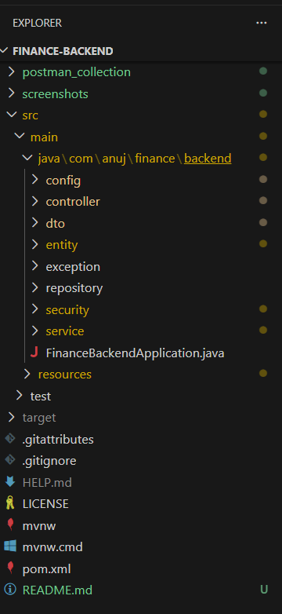
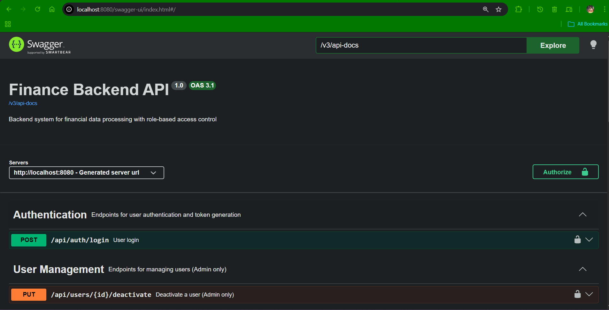
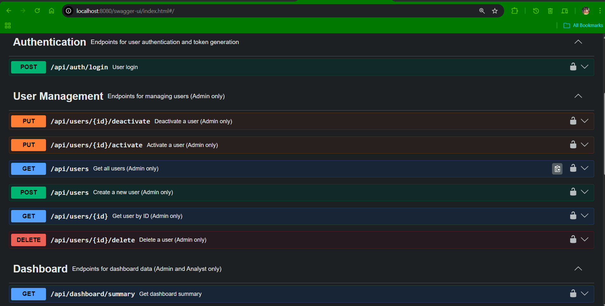
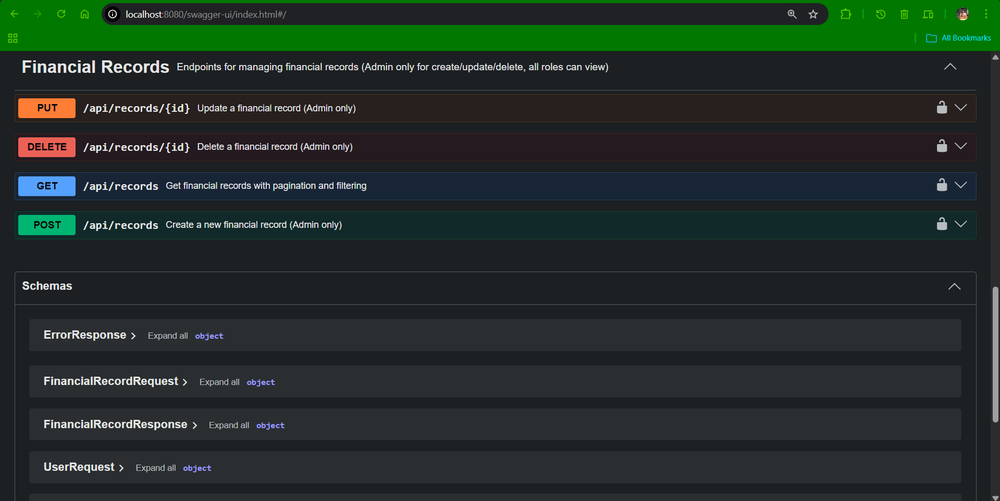
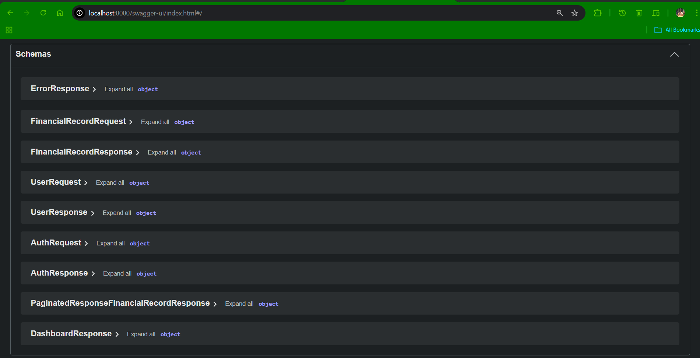

# Finance Backend API (RBAC + JWT + Dashboard)

A secure and scalable backend system for managing financial records with role-based access control (RBAC), built using Spring Boot.

---

## Overview

This project simulates a real-world finance dashboard backend where users interact with financial data based on their roles. It demonstrates backend architecture, API design, authentication, authorization, and data aggregation.

---

## Project Structure



```
finance-backend/
│── src/                    # Source code (controllers, services, entities, security)
│── postman_collection/     # Postman collection for API testing
│── pom.xml                 # Maven configuration
│── mvnw / mvnw.cmd         # Maven wrapper
│── .gitignore              # Ignored files
│── LICENSE
│── README.md
```

---
## Highlights

- Secure REST APIs with JWT authentication
- Role-Based Access Control (ADMIN / ANALYST / VIEWER)
- Financial data aggregation (income, expense, balance)
- Swagger API documentation with JWT support
- Clean layered architecture

---
## 🚀 Tech Stack

* Java 21
* Spring Boot 3.3.x
* Spring Security (JWT Authentication)
* Spring Data JPA (Hibernate)
* MySQL
* Maven
* Swagger (OpenAPI) - SpringDoc OpenAPI 2.x.x

---

## 🔐 Authentication & Authorization

* JWT-based authentication
* Stateless session management
* Role-Based Access Control (RBAC)

### Roles

```text
| Role    | Permissions                          |
| ------- | ------------------------------------ |
| ADMIN   | Full access (CRUD + user management) |
| ANALYST | Read records + dashboard             |
| VIEWER  | Read-only access                     |
```

### HTTP Status Codes
```text
| Code |        Meaning        |
|------|-----------------------|
| 200  | Success               |
| 201  | Created               |
| 400  | Bad Request           |
| 401  | Unauthorized          |
| 403  | Forbidden             |
| 404  | Not Found             |
| 500  | Internal Server Error |
```
---

## Features

### User Management ( ADMIN only)

* Create users
* Assign roles
* Activate/Deactivate users
* Role-based restrictions

---

### Financial Records

* Create, update, delete records
* View all records
* Pagination support (page, size and type)
* Filtering by record type (INCOME / EXPENSE)
* Category-based classification
* Ownership-based update restriction

---

### Dashboard APIs

* Total Income
* Total Expense
* Net Balance
* Category-wise aggregation

---

### Security

* JWT authentication
* Custom UserDetailsService
* Method-level authorization (`@PreAuthorize`)
* Secure API endpoints

---

### Validation & Error Handling

* Input validation using `@Valid`
* Global exception handling
* Structured error responses

---

## API Documentation

Swagger UI: This project uses **Swagger (springdoc-openapi)** to provide interactive API documentation.

--> http://localhost:8080/swagger-ui/index.html 

--- 

### Swagger UI Screenshots
Below are screenshots of the Swagger UI for this project:





---

## Postman Collection

Import the provided collection:


---

## Sample Credentials

### Admin

email: [admin@test.com]
password: Admin@test1234

### Analyst

email: [analyst@test.com]
password: Analyst@test1234

### Viewer

email: [viewer@test.com]
password: Viewer@test1234

---

## Setup Instructions

### 1. Clone Repository

```
git clone https://github.com/Anuj-Kumar-1952/Finance-Data-Processing-and-Access-Control-Backend
cd finance-backend
```

---

### 2. Configure Application

Rename:

```
application-example.properties → application.properties
```

Update with your credentials:

```
spring.datasource.url=jdbc:mysql://localhost:3306/your_database_name
spring.datasource.username=YOUR_USERNAME
spring.datasource.password=YOUR_PASSWORD

app.jwt.secret=YOUR_SECRET_KEY
app.jwt.expiration-ms=3600 # JWT token valid for 1 hour
```

---

### 3. Run Application

```
mvn spring-boot:run
```

---

### 4. Access Swagger

```
http://localhost:8080/swagger-ui/index.html
```

---

## Key Design Decisions

* Layered architecture (Client -> Security Filter Layer -> Controller -> DTO <-MAPPINGS-> Entity -> Service → Repository)
* JWT-based stateless authentication
* RBAC using Spring Security
* Ownership validation for secure updates
* Centralized exception handling

---

## 

Anuj Kumar
ak1952002@gmail.com

---

## Final Note

This project was built as part of a backend engineering assignment to demonstrate real-world backend development skills including security, data processing, and API design.
